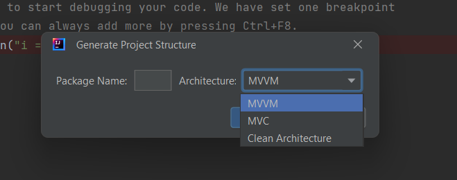

# **GenArch**  

  

**GenArch** is a JetBrains IDE plugin that helps developers quickly generate project structures (e.g., MVVM, MVC, Clean Architecture) with ease. Save time and focus on writing code, not boilerplate.

---

## **Features**

- 🛠 **Project Structure Generation**  
  Quickly scaffold project architectures like:
  - MVVM
  - MVC
  - Clean Architecture  
- 🎯 **Customizable Package Names**  
  Generate files and directories under your specified package name.
- 🗂 **Template-Based Code Creation**  
  Create pre-filled templates for ViewModels, Repositories, Controllers, and more.
- 🚀 **Seamless Integration**  
  Works seamlessly with IntelliJ IDEA, Android Studio, and other JetBrains IDEs.

---

## **Installation**

### **From JetBrains Marketplace**  
1. Open your JetBrains IDE (IntelliJ IDEA, Android Studio, etc.).  
2. Navigate to `File > Settings > Plugins` (on macOS: `IntelliJ IDEA > Preferences > Plugins`).  
3. Search for **GenArch** in the Marketplace tab.  
4. Click **Install** and restart your IDE.

### **Manually (from ZIP file)**  
1. Download the plugin ZIP file from [Releases](https://plugins.jetbrains.com/plugin/com.wahid.GenArch).  
2. Open your IDE and navigate to `File > Settings > Plugins > ⚙ > Install Plugin from Disk`.  
3. Select the downloaded ZIP file and restart your IDE.

---

## **Usage**

1. Go to **Tools > Generate Architecture** in the top menu bar.
2. Fill out the form:
   - **Package Name**: Enter the base package name (e.g., `com.example.app`).
   - **Architecture Type**: Choose from available options like MVVM, MVC, or Clean Architecture.
3. Click **Generate**.  
   - The plugin will create folders like `viewmodel`, `repository`, `controller`, etc., based on your chosen architecture.
   - Template files (e.g., `MainViewModel.kt`, `Repository.kt`) will be pre-filled and ready to edit.

---

## **Video Demo**

https://github.com/user-attachments/assets/a5a2b415-53ed-4f20-b752-400eabad53bf

## **Screenshots**

### **From Tools Select Generate Architecture**  

### **Architecture Dialog Selection**  

### **Generated Project Structure**

---

## **Configuration**

The plugin uses template files located in the project resources. Customize these files if needed to match your coding standards:

1. Navigate to `resources/templates/` in the plugin directory.
2. Modify files like `ViewModelTemplate.kt`, `RepositoryTemplate.kt`, etc.
3. Reload the plugin to apply changes.

---

## **Support**

- For questions, issues, or feature requests, please visit the [GitHub Repository](https://github.com/WAHID-QANDIL/GenArch).
- You can also contact me at [E-Mail](mailto:wahidqandill@gmail.com).

---

## **Changelog**

### **v1.0.0**  
- Initial release
- Added support for MVVM, MVC, and Clean Architecture project structures

---

## **License**

This plugin is licensed under the MIT License. See the [LICENSE](LICENSE) file for details.
